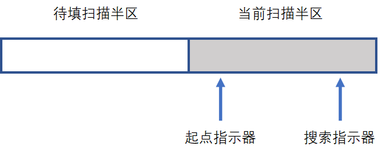
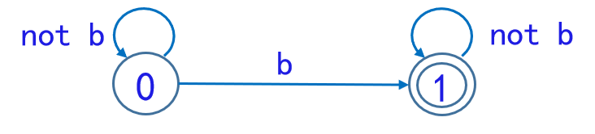
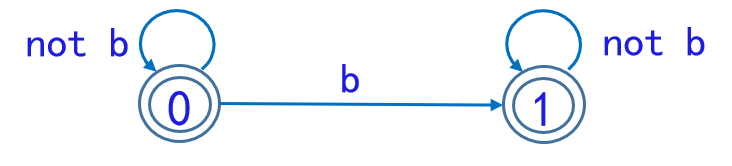
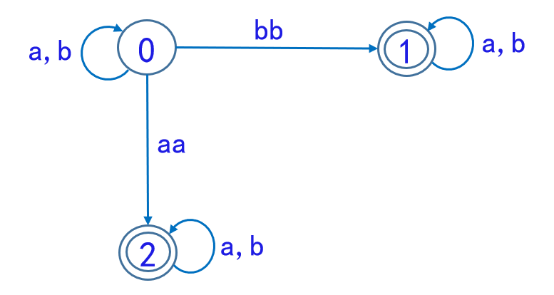

# 词法分析——有限自动机

有关形式语言的计算模型有很多，根据前置章节我们已经了解到文法和自动机，这里我们从编译过程中的一个步骤作为切入点，来认识自动机模型发挥的作用。在编译流程对源语言（也是一种形式语言）处理中，词法分析（lexical analysis）是指将字符序列转换为标记（token）序列的过程。人们理解一篇文章是从**单词**级别来思考的，同样，编译程序也是在单词的级别上来分析和翻译源程序的。词法分析的任务便是：**从左至右逐个字符地对源程序进行扫描**，**产生一个个的单词符号**。词法分析是编译的基础。

## 词法分析器

进行词法分析的程序或者函数叫作**词法分析器**（lexical analyzer，简称 lexer），也叫**扫描器**（scanner）。词法分析器一般以函数的形式存在，供语法分析器调用。本章内容主要介绍词法分析中的常见模型。

### 功能与输入输出

词法分析器的功能是：

- 输入源程序
- 输出单词符号

关于单词符号，程序语言的单词符号一般可分为：关键字、标识符、常数、运算符、界符。

### 独立子程序

这是一个有趣的问题，我们可以把词法分析当作广义语法分析的一部分（被包含进语法分析中），但是将词法分析器作为可供语法分析器调用的**子程序**还是独立进行的**预扫描**，并没有严格的对错之分，分析两者的优劣如下：

- **子程序**：可以使整个编译程序的结构简洁、清晰、条理化。词法分析比语法分析要简单得多，可用更有效的特殊方法和工具进行处理。
- **预扫描**：将词法分析和语法分析完全解耦合，预先对整个程序进行单词符号的翻译。这种做法意味着必须在文件中保存整个源程序的内码形式。

实际上考虑到保存内码形式似乎是没有必要的。一般情况下我们把词法分析安排成一个**子程序**，每当语法分析器需要一个单词符号时就调用这个子程序。

### 输入预处理

词法分析器调用它时，它就处理出一串确定长度的输入字符，并将其装进词法分析器所指定的缓冲区中（称为**扫描缓冲区**）

扫描器可以在此缓冲区中直接进行单词符号的识别，而不必照管其他繁琐事务；

扫描器对缓冲区进行扫描时一般用两个指示器，一个指向当前正在识别的单词的开始位置（起点指示器），另一个用于向前搜索以寻找单词的终点（搜索指示器）。需要注意的是，由于不论扫描缓冲器被设计得有多大，都不能保证单词符号不会被它得边界所打断。所以，设计者一般将缓冲区设计成一分为二的两个**缓冲半区**区域。

??? question "思考：为什么这种策略是有效的？"

    双指针加缓冲半区策略就是为了扫描至每个半区边界时可以让另一半区加载而不会影响本半区的搜索起点。

    每个半区容纳一定量字符（例如120个），两个半区互补使用，如果搜索指示器从单词起点出发搜索到半区的边缘但尚未到达单词的终点，那么就应调用预处理程序，令其把后续的输入字符装进另半区。我们认为，在搜索指示器对另半区进行扫描的期间内，现行单词的终点必定能够到达，这要求对标识符和常数的长度必须加以限制：**不得多于半区长度**（例如，不得多于120个字符）。

    

## 正规式与正规集

笔者跳过了形象化的状态转换图，这里直接叙述必要的形式化概念，和后续的模型，省略了一些编译无关的证明（~~有勇气的你可以自己查阅文献证明~~）。

### 基本概念

- **字母表**：元素的非空有限集，记为$\Sigma$。例：$\Sigma = \{ a, b, c \}$
- **符号**：字母表中的元素。例：$a,b,c$字母表包含了语言中所允许出现的所有符号。
- **字（符号串）**：有符号构成的有穷序列。例：$a,aa,ac,abc,\cdots$
- **空字（空串）**：无任何符号的符号串称为，记为$\epsilon$
- **字集（符号串集合）的连接积**：若$A,B$为$\Sigma^*$（该字母表的符号串全体）的子集，$A$和$B$的连接积定义为$UV = \{ \alpha \beta | \alpha \in A , \beta \in B \}$
- **字集（符号串集合）的自反闭包**：$A^{*} = \{ \epsilon \} \cup A^+$。闭包中每个字都是由$A$经有限次连接而成的。
- **字集（符号串集合）的正则闭包**：$A^{+} = A^1 \cup A^2 \cup \cdots \cup A^n \cdots$

### 正规式与正规集定义

对于字母表$\Sigma$，我们感兴趣的是它的一些特殊字集，即所谓**正规集**。**正规式**概念用于表示（导出）正规集。下面是两者的递归定义：

1. $ε$和$Φ$都是$∑$上的正规式（Regular Expression），它们所表示的正规集分别是$\{ε\}$和$Φ$
2. 任何$a \in ∑$，$a$是$∑$上的一个正规式，它所表示的正规集为$\{ a \}$
3. 假定$U$和$V$都是$∑$上的正规式，它们所表示的正规集分别记为$L(U)$和$L(V)$,那么$(U|V)$、$(U \cdot V)$和$(U)^*$也都是正规式，它们所表示的正规集分别为$L(U)∪L(V)$，$L(U)L(V)$（连接积）和$(L(U))^*$（闭包）。

仅由有限次使用上述三步骤而得到的表达式才是$\Sigma$上的**正规式**。仅由这些正规式所表示的字集才是$\Sigma$上的**正规集**。

### 正规式的运算符

再阐述定义第三点中涉及的“运算符”：

- “$|$”读为“或”
- “$\cdot$” 读为“连接”
- “$*$”读为“闭包”

规定算符优先顺序为：$* > \cdot > |$，连接常可省略不写。

### 正规式的性质

1. $U|V = V|U$（交换律）
2. $U|(V|W) = (U|V)|W$（结合律）
3. $U(VW) = (UV)W$（结合律）
4. $U(V|W) = UV|UW$，$(V|W)U = VU|WU$（分配律）
5. $\epsilon U = U \epsilon = U$

## 确定有限自动机（DFA）

### DFA 的定义

一个**确定有限自动机**（Definite Finite Automaton）是一个五元组

$$M=(S,∑,\delta,S_0,Z)$$

其中：

1. $S$是一个有限集，它的每个元素称为一个**状态**
2. $∑$是一个**有穷字母表**，它的每个元素称为一个输入字符
3. $\delta$是一个从$S×∑$至 S 的（单值）部分映射。$\delta(s，a)=s'$意味着：当现行状态为$s$,输入字符为$a$时，将转换到下一个状态$s'$。我们把$s'$称为$s$的一个**后继状态**
4. $S_0 \in S$是**唯一的初态**
5. $Z⊂S$是一个**终态集**（可空）

### DFA 状态转换图

自动机是表示语言的数学模型，该模型本身又有几种表示方式，最直观的方式是图表示。对于 DFA 而言，我们用圆圈和连接的弧来表示不同状态与字符。对于$\sum^*$中的任何字 α，若存在一条从初态结到某一终态结的道路，且这条路上所有弧的标记符连接成的字等于$α$，则称$α$可为 DFA M 所识别（读出或接受）。

下面是结合转换图的 DFA 的一些示例：

1. 串中仅有一个$b$的字的集合被下面的 DFA 所识别

   

2. 包含最多一个$b$的字的集合被下面的 DFA 所识别

   

### 状态转换矩阵

一个 DFA 可用一个矩阵表示，行表示状态，列表示输入字符，元素表示$\delta(s,a)$的值。这个矩阵称为**状态转换矩阵**

??? note "思考一下"
为什么一个“矩阵”就可以表示了呢，其实，根据定义我们发现，行列了 DFA 定义中的 1、2 描述。而矩阵的值对应 3 描述。4、5 需要自行补充。

    从这个矩阵看，你会发现DFA“短浅”但“专一”：

    - **短浅**：是指它一次只能向前看一个字符，不能多（这和一些高级自动机产生了差异）。
    - **专一**：是指它相同状态和字符组合，映射值相同（而后面的NFA则不“专一”），这就是DFA**确定性**表现。

## 非确定有限自动机（NFA）

### NFA 的定义

一个**非确定有限自动机**（Non-definite Finite Automaton）是一个五元式

$$M=(S,∑,\delta,S_0,Z)$$

其中：

1.  $S$同 DFA 的 1；
2.  $∑$同 DFA 的 2；
3.  $\delta$是一个从$S×∑^*$到$S$的**子集**的映射，即

    $$\delta  S×∑→2^s$$

4.  $S_0⊂S$是一个**非空初态集**；
5.  $Z⊂S$是一个终态集（可空）。

??? note "思考：为什么要引入 NFA"

    还记得之前提到DFA很“专一”么，这里我们发现NFA竟然是到$S$子集的映射，如何理解？相同状态，相同字符可能会转移到不同状态。有的同学可能会疑惑了，这怎么可能，状态机不就乱掉了？别急，我们能够证明DFA和NFA是等价的，即表达能力相同，可相互转化，你会在词法分析下一章Wiki中看到。

    再回到思考问题上，**我们为什么要引入NFA**？实际上，在设计过程中，我们可能会考虑多个起始点，各自按照自己的DFA识别一个记号，但是完整词法分析器需要满足唯一的$S_0$。若是直接合并之前的部分设计，我们就会遇到困难——可能存在相同前缀的符号。如果要按照DFA的要求，需要做大规模人工调整，这岂不是多做了很多无用功？于是乎计算机学家给出NFA表示，并证明了表达能力与DFA等价，即我们可以先不管“专一”（确定）的问题，使用NFA设计，再通过等价性（构造算法），得到我们想要的DFA。

    一言以蔽之：**NFA便于人类设计**，**DFA则便于机器理解**，但殊途同归，二者表达能力相等。

### NFA 状态转换图

下面这个 NFA 所能识别的是哪些字？

??? success "答案"

    含有相继两个$a$或者相继两个$b$的字。
