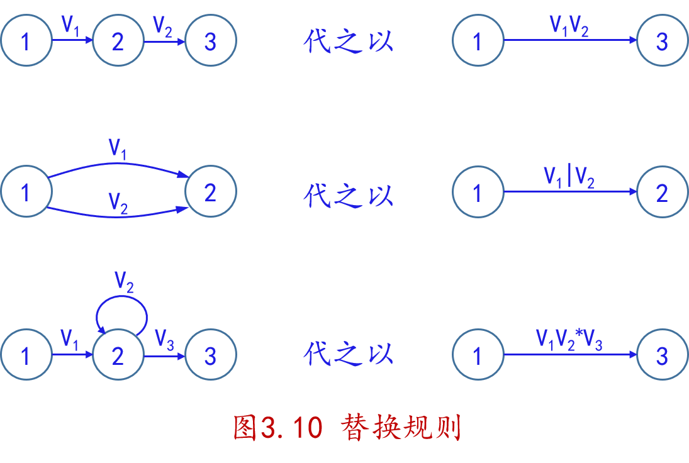
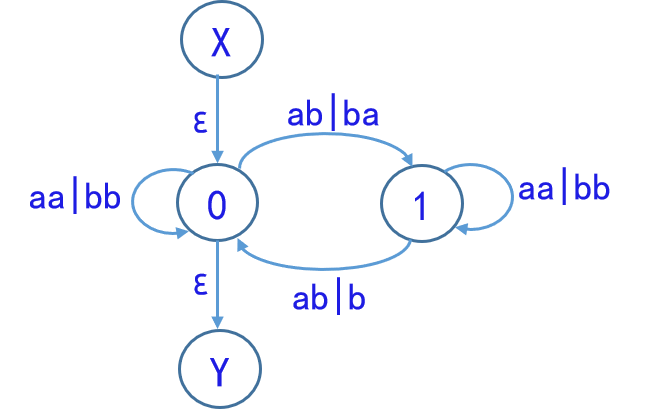
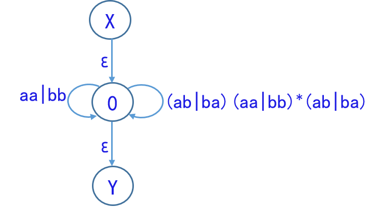
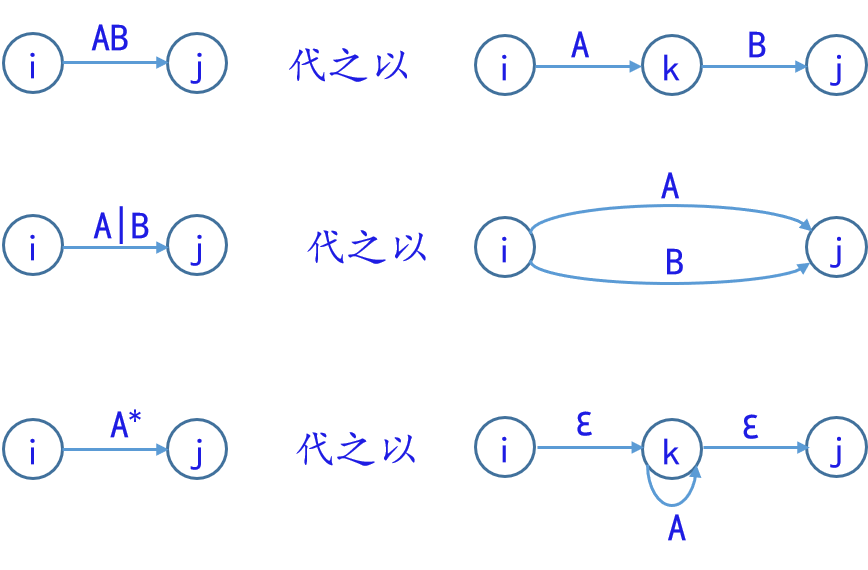

# 词法分析——转换算法

（本章较多图与文字来源于XDZ老师的PPT，笔者负责整理）

本章介绍词法分析中几种表示的转换算法，通过构造来证明不同模型间的等价性（构造性证明）。不同的等价性命题与转换算法的对应关系如下：

|             等价性命题              |                      转换算法                      |
| :---------------------------------: | :------------------------------------------------: |
|    正规文法与 FA（NFA） 的等价性    | 可先证正规文法与正规式的等价性，或参考《编译原理》 |
|     正规式与 FA（NFA） 的等价性     |                   Thompson 算法                    |
|         NFA 与 DFA 的等价性         |                     子集构造法                     |
| DFA 化简（DFA 与简化 DFA 的等价性） |                   Hopcroft 算法                    |

## 正规文法与 FA（NFA） 的等价性

标题加了括号是因为，这里证明与 NFA 等价，后面还有 NFA 和 DFA 的等价性证明，所以实际上正规文法和 FA 等价。

命题表示：对于正规文法$G$ 和有限自动机$M$，如果$L(G) = L(M)$，则称$G$和$M$是等价的。关于正规文法和有限自动机的等价性，有以下结论：

1. 对每一个右线性正规文法$G$ 或左线性正规文法$G$，都存在一个有限自动机（FA）$M$，使得$L(M) = L(G)$。
2. 对每一个有限自动机 $M$，都存在一个右线性正规文法$G_R$和左线性文法$G_L$，使得$L(M) = L(G_n) = L(G_L)$。

<!-- TODO -->

待完成

### 证明 1：正规文法 $\Rightarrow$ FA

### 证明 2：FA $\Rightarrow$ 正规文法

## 正规式与 FA（NFA） 的等价性

### 证明 1：FA $\Rightarrow$ 正规式

把转换图的概念拓广，令每条弧可用一个正规式作标记；

在$M$的基础上构造$M'$，$M$转换图上加进两个结，一个为$X$结，另一个为$Y$结；

- 从$X$结用$ε$弧连接到$M$的所有初态结；
- 从 M 的所有终结用$ε$弧连接到 Y 结

显然，$L(M)=L(M')$，即，这两个 NFA 是等价的，且$M'$只有一个初态一个终态。

反复使用下图所示的替换规则，消去所有的结最后达到 X--正规式-->Y。

!!! question "问题"

    下图经消结后，对应的正规式是什么，识别的是什么语言

    

??? success "答案"

    正规式为$((aa|bb)(ab|ba)(aa|bb)*(ab|ba))*$，识别的是**含偶数个a和偶数个b的字**，消去过程如下：

    

    

    

## 证明 2：正规式 $\Rightarrow$ FA

需说明，证明分为两步

1. 构造$\sum$上的 NFA $M'$，使得$L(M')=L(V)$
2. $M'$确定化（这部分即下个证明）

反过来构造其实很简单，就是证明 1 的逆过程，逐步拆开。

首先把正规式 $V$ 表示为拓广转换图（X--正规式-->Y），然后通过对 $V$ 进行分裂和加进新结的办法，逐步把这个图转变成：每条弧标记为 $Σ$ 的一个字符或 $ε$。

使用下面的替换规则

在整个分裂过程中，所有新结均用不同的名字，保留$X$和$Y$为全图唯一的初态结和终态结，至此，得到了一个 NFA $M'$
显然，$L(M')=L(V)$。

## NFA 与 DFA 的等价性

<!-- TODO -->

待完成

## DFA 化简

<!-- TODO -->

待完成