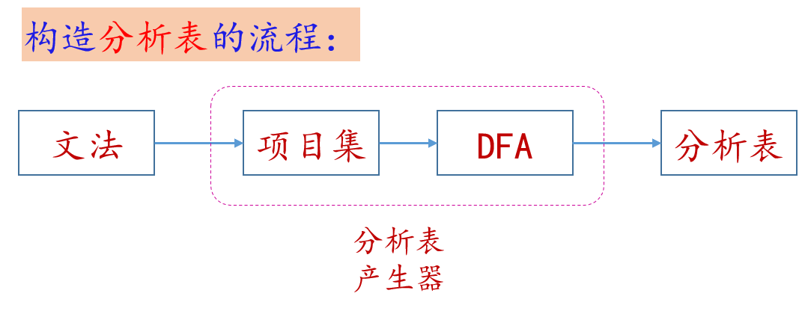
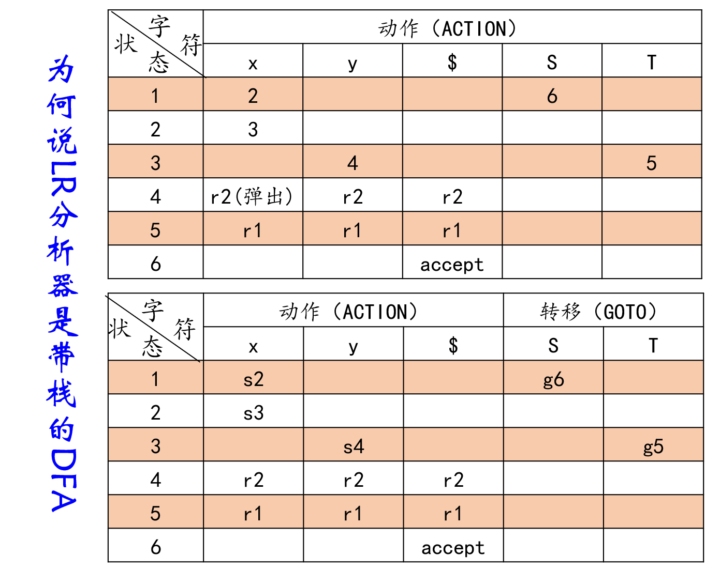
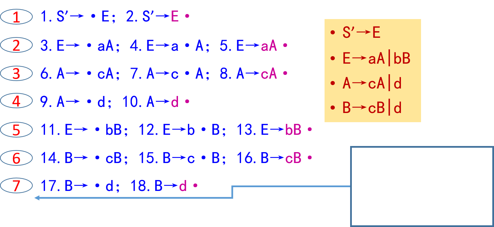

# 语法分析——LR 分析法

## 概述

本节介绍一个有效的自下而上分析技术，它可用于很大一类上下文无关文法的语法分析，这种技术被称做 LR 分析法（LR Parsing）。这里 L 表示从左到右扫描输入串，R 表示构造一个最右推导的逆过程。

> **L**eft to right within each line producing a **R**ightmost derivation in reverse.

### 优缺点

其主要的优缺点为:

1.  **能力较强**：大多数用上下文无关文法（CFG）描述的程序语言都可用 LR 分析器予以识别。

    比算符优先分析法或其他“移进——归约”技术更加广泛，识别效率不比他们差。能用 LR 分析器分析的文法类，包含能用 LL(1)分析器分析的全部文法类，LR 分析法在自左至右扫描输入串时就能发现其中的任何错误，并能准确地指出出错地点。

2.  **工作量大**：若用手工构造分析程序则工作量相当大。

    因此，必须求助于自动产生这种分析程序的产生器。现在人们已设计初这样的专用工具，如 YACC（还有相关的 GNU Bison）。

### 分析表

自下而上的分析法的关键是：**分析表**。

!!! note "回忆：算符优先分析"

    算符优先分析过程中，在归约条件限制下，实际上**算符优先表**充当了分析表。

LR 分析器的核心就是构造并使用这样一张对应的分析表，这张分析表包括两部分，一是“动作”（ACTION）表，另一是“状态转换”（GOTO）表。它们都是二维数组。

- $\mathrm{ACTION}[s,a]$规定了当状态为$s$，面临输入符号$a$时应采取什么动作。
- $\mathrm{GOTO}[s,X]$规定了当状态为$X$（终结符或非终结符），面临文法符号$S$时应采取什么动作。

笔者从后面的学习中理解到，其实$\mathrm{ACTION}$与$\mathrm{GOTO}$根本上是一致的，请参见下面 LR 分析器部分。

构造分析表的流程为：

## LR 分析器

从逻辑上说，一个 LR 分析器包括两部分：

- 一个总控（驱动）程序
- 一张分析表

其中**分析表**是关键，所有 LR 分析器的总控程序都是相近的，只是分析表各不相同。

LR 分析器模型如下:

LR 方法的基本思想：

- 在分析中，记住已移进和归约出的符号串，根据所用的产生式推测未来可能碰到的输入符号；
- 根据“历史”、“未来”以及“现在”的输入符号这三方面的信息，来确定已经被扫描的符号串中是否有句柄在其中。

一个 LR 分析器实质上是一个带先进后出存储器（栈）的 DFA。

??? note "从分析表的角度理解 LR 分析器是带栈的 DFA"

    之前我们已经见到过DFA的状态转换表，实际上，在LR分析表中，我们引入了$ACTION$和$GOTO$，状态机的行为似乎比DFA更复杂了。

    实际上，复杂是复杂了，但并不在$ACTION$和$GOTO$，参考下面两幅图。

    

    所谓“带栈”，核心区别是多了$r_n$的状态机行为，即需按照文法，将“吃进去”（入栈）的字符串“吐出来”变为非终结符。对比DFA，就是无栈只管眼前的输入。所以说LR分析器是带栈的DFA。

具体识别例子请参考 PPT 或者教材。

## LR 文法

### 定义

就像算符优先文法一样，给出分析表，我们便能接着进行文法分析，我们**关心**分析表是如何构造出来的。

!!! note "LR 文法"

    对于一个文法，如果能够构造一张分析表，使得它的每个入口均是唯一确定的，则我们就把这个文法称为 LR 文法。

!!! note "LR(k) 文法"

    对于一个文法，如果能用一个每步顶多向前检查 k 步输入符号的 LR 分析器进行分析，则这个文法就是 LR(k)文法。

但对多数的程序语言来说，$k=0$或$1$就足够了。因此，我们只考虑$k \le 1$的情形。

### 性质

1. LR 文法是文法无二义性的**充分条件**。
2. LR 文法属于上下文无关文法（CFG），但并非所有上下文无关文法都是 LR 文法。
3. 大多数程序语言都可用 LR 文法描述。

## LR(0)分析器

### 概念解释

1.  **前缀**:

    字符串的前缀是该字符串的任意首部。

2.  **活前缀**：

    活前缀是指规范句型的一个前缀，这种前缀不含句柄之后的任何符号。

    1.  **可归活前缀**：

        活前缀的尾部正好是句柄，这时，可以进行归约。

        归约之后又成为另一句型的活前缀；

    2.  **非可归活前缀**：

        句柄尚未形成，需要继续移进若干符号之后才能形成句柄。

3.  **项目**：

    对于一个文法$G$，构造一个能识别$G$的所有活前缀，这个 NFA 的每个状态时下面定义的一个“项目”。文法$G$每一个产生式的右部添加一个圆点称为$G$的一个**LR(0)项目（简称项目）**。

    ??? note "产生式$A \rightarrow XYZ$对应的四个项目"

        $$A\rightarrow \cdot XYZ$$

        $$A\rightarrow X \cdot YZ$$

        $$A\rightarrow XY \cdot Z$$

        $$A\rightarrow XYZ \cdot $$

    加"$\cdot$"的**目的**是用来表示分析过程中的状态（机器“目视”位置）

    - "$\cdot$"的左边是历史
    - "$\cdot$"的右边是展望

LR（0）项目集族是只概括历史而不含展望的许多项目集，每一个项目集是一个状态；这些状态能够识别活前缀和句柄。

自底向上分析法的关键是：

- 在分析过程中确定**句柄**；
- LR 方法中的句柄是通过求**可归前缀**而求得。

### 关于活前缀

通俗版解释：可以合成**符合语言语法**的字符串的前缀（viable prefix）。

一个简单的推理：**如果某字符串是活前缀**，**则它的所有前缀也都是活前缀**。

形式描述：

文法$G=(V_n,V_t,P,S)$，若有$S' \overset{*}{ \Rightarrow } \alpha A \omega \Rightarrow \alpha \beta \omega$，$A \rightarrow \beta$，则$\beta$是句柄。

- $\gamma$是$\alpha \beta$的前缀，则称$\gamma$是文法$G$的**活前缀**。
- $\alpha \beta$含句柄的活前缀，并且句柄是$\alpha \beta$的后端，则称$\alpha \beta$是**可归前缀**（也作**归态活前缀**）。

在 LR 分析过程中，实际上是把$αβ$的前缀（即文法$G$的活前缀）列出放在符号栈中；

一旦在栈中出现$αβ$（形成可归前缀），即句柄已经形成，则用产生式$A \rightarrow β$进行归约。

识别活前缀只是表面现象！真实的目的是，找到**句柄**！

### 构造识别活前缀 DFA （方法一）

#### 构造文法的所有项目

对于每个产生式，去标“点”吧！

下图给出文法

$$
\begin{aligned}
    S' & \rightarrow E \\
    E & \rightarrow aA|bB \\
    A & \rightarrow cA | d \\
    B & \rightarrow cB | d \\
\end{aligned}
$$

??? note "对应的项目构造"

    

- 加入$S' \rightarrow E$是为了使得结束状态唯一。
- $S'$不会出现在任何产生式的右边，因此含有$S'$的可归项目（状态）就是唯一的。

#### 构造 NFA

用项目作为状态来构造 NFA，用来识别这个**文法的所有活前缀**，规定项目 1 为 NFA 的唯一初态。

任何状态（项目）均认为是 NFA 的终态（活前缀识别态）。

如果状态 $i$ 和 $j$ 出自同一产生式，而且状态 $j$ 的圆点只落后于状态 $i$ 的圆点一个位置，即：

- $i$ 状态：$X \rightarrow X_1X_{i-1} \cdot X_iX_n$
- $j$ 状态：$X \rightarrow X_1X_i \cdot  X_{i+1}X_n$

那么，就从状态 $i$ 画一条标志为 $X_i$ 的弧到状态 $j$。

假如状态$i$的圆点之后为非终结符，如$i$ 为 $X \rightarrow \alpha \cdot A \beta$，$A$为非终结符，则从状态$i$画$\epsilon$弧到所有$A \rightarrow \cdot \gamma$。

#### 转换成 DFA

使用词法分析部分介绍过的**子集构造法**，将识别活前缀的 NFA 确定化得到 DFA。

最终得到的这个 DFA 是建立 LR 分析的基础。

### 构造识别活前缀 DFA （方法二）

通过 CLOSURE 的方法构造识别活前缀的 DFA（计算机善用）。

#### 构造闭包

闭包，不再增大。

假定$I$是文法$G'$的任一项目集，定义和构造$I$的闭包$\mathrm{CLOSURE(I)}$的方法：

1. $I$的任何项都属于$\mathrm{CLOSURE(I)}$
2. 若$A \rightarrow \alpha \cdot B \beta$属于$\mathrm{CLOSURE(I)}$，那么，对任何关于$B$的产生式$B \rightarrow \gamma$，项目$B \rightarrow \cdot \gamma$也属于$\mathrm{CLOSURE(I)}$。
3. 重复执行上述两部分直至$\mathrm{CLOSURE(I)}$不再增大为止。

#### 有效项目

通俗解释：任意一条 DFA 开始状态到某状态所经路径上的字符串是活前缀，而此状态中的项目对此活前缀都是有效的，因此，是这个活前缀的有效项目。

#### 构造算法

<!-- TODO -->

待后续补充

### LR(0) 分析表的构造

对于 LR(0)文法，可直接从它的项目集规范族 $C$ 和活前缀识别自动机的状态转换函数 $\mathrm{GO}$ 构造出 LR 分析表。

1. 若项目$A→α \cdot aβ$属于$I_k$，且$GO\{I_k,a\}=I_j$，$a$为终结符，则置$\mathrm{ACTION} [k，a]$为“把$(j,a)$移进栈”，简记为“$s_j$”。
2. 若项目$A \rightarrow α \cdot$属于$I_k$，那么，对任何终结符$a$（或结束符$\#$），置$\mathrm{ACTION} [k，a]$为“用产生式$A \rightarrow α$进行归约”，简记为“$r_j$”(假定产生式$A \rightarrow α$是文法 $G'$的第 $j$ 个产生式)
3. 若项目$S' \rightarrow S \cdot$属于$I_k$，则置$\mathrm{ACTION}[k,\#]$为“接受”，"$acc$"。
4. 若$GO(I_k,A) = I_j$，$A$为非终结符，则置$\mathrm{GOTO}(k,A) = j$
5. 分析表中凡不能用规则 1 至 4 填入纤细的空白格均置上“报错标志”
