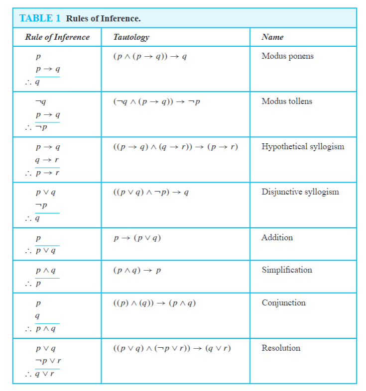
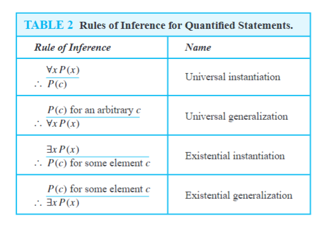

# 逻辑与证明——推理证明方法

## 推理规则

### 有效推理

命题逻辑中的**论证**指的是一系列命题：论证中除了最后的命题外，其余都称为**前提**，最后的命题称为**结论**。如果它所有前提为真蕴含结论为真，则这个论证形式是**有效**的。总结一下：

- **论证**：是指以一个命题结尾的一系列命题陈述。
- **结论**：论证的结尾，推得的命题。
- **前提**：论证的系列命题除去结论都是前提。
- **有效**：论证的最后结论，是根据前提为真时推得的，则论证有效。

??? note "英文定义"

    Anargumentin propositional logic is a sequence of propositions. All but the final propositionin the argument are calledpremisesand the final proposition is called theconclusion.Anargument isvalidif the truth of all its premises implies that the conclusion is true.Anargument formin propositional logic is a sequence of compound propositions involv-ing propositional variables. An argument form isvalidno matter which particular proposi-tions are substituted for the propositional variables in its premises, the conclusion is true ifthe premises are all true.

### 命题逻辑的推理规则

永真式$(p \land ( p \rightarrow q )) \rightarrow q$是推理的基本方法，称为**演绎推理**（modus ponens），其他相近的推理规则如下表描述

### 谓词逻辑的推理规则

我们已经讨论了命题的推理规则。现在，我们将描述一些重要的命题的推理规则，涉及量词。这些推理规则在数学论证中广泛使用，通常没有被明确提及

## 证明简介

### 一些术语

1.  **theorem**：A theorem is a statement that can be shown to be true.

    - The term theorem is usually reserved for a statement that is considered at least somewhat important.
    - Theorems can also be referred to as facts or results.

2.  **proposition**：Less important theorems sometimes are called propositions.
3.  **proof**：A proof is a valid argument that establishes the truth of a theorem.

    - We demonstrate that a theorem is true with a proof.

4.  **axiom**：The statementsused in a proof can include axioms(or postulates), which are statements we assume to be true.
5.  **lemma**：A less important theorem that is helpful in the proof of other results is called a lemma(plural _lemmas_ or _lemmata_ ).

### 证明方法

1.  直接证明（Direct Proofs）
    - Often reach dead ends.
2.  反证法（Proof by Contraposition）
