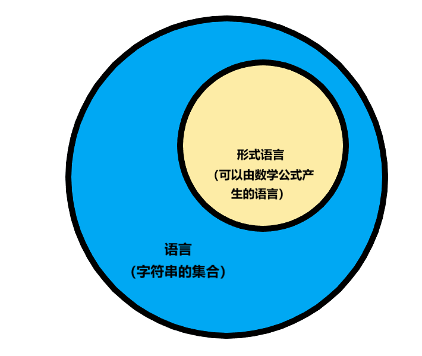
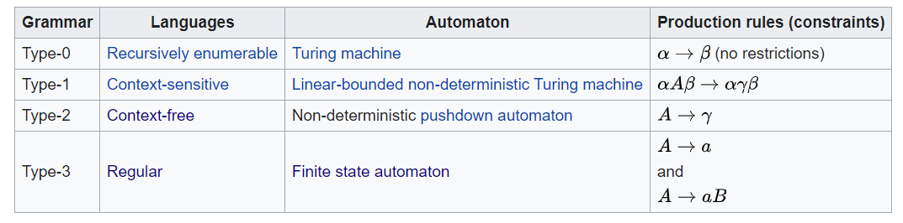

# 语言与语法描述

编译和编程语言息息相关，在打开编译原理这个新世界的大门前，希望先和你聊聊编程语言。

**编程语言**是计算机科学发展至今的一个重要概念，不过就国内教学而言，笔者个人认为相关知识普及度并不高。虽然在过去的学期中你应该上过基础编程课程，并通过课程设计使用至少一门语言进行过项目开发，笔者认为你和**编程语言**最多也只能算“好朋友”的层级。因为我们并不是在谈你**应用语言**的能力，而是在说**理解语言**的能力，想要深入了解你这位“好朋友”——它的脑回路/相关背景/前世今生，作为 CS 专业的学生，你还要做不少功课。本章就是从语法角度去介绍高级语言（编程语言）相关内容。

## 何为“语言”

广义的“语言”覆盖范围非常广，你的母语“汉语”、学了多少年都没掌握的“英语”是“语言”，编程使用的 C++，号称世界上最好的 XX 的 PHP 也是“语言”。你可以直观和抽象的感受到各种“语言”，但你有没有考虑过，**什么是语言**，或者说，**语言的定义是什么**。

一行人说一行话，语言学讲“语言”是一个概念，是社科方面的理解。作为一个 CS 的学生，这里所提“语言的定义”是指“语言的数学定义”。既为定义，就要普世、精确。其实“语言”定义很简单：**语言就是字符串的集合**。

语言是字符串的集合，我们可以进一步用一个公式产生某些字符串的集合，遗憾的是，有些字符串的集合是找不到公式来产生的。言下之意，有些肯定是可以用公式产生的。我们编译原理关心的是这些可以由数学公式产生的字符串的集合（即语言），称为**形式语言**。精确一些的描述，**形式语言就是用数学公式定义的具备特定规则的语言**，那么**形式语言**和**语言**的关系就很好理解啦~。

人类的自然语言是不可以用数学公式表达出来的，否则，自然语言识别就是 100%准确并且 100%听懂人类语言的机器人也能被制造出来。

尽管人类语言无法用数学公式统一表达，但是程序设计语言是可以的。实际上，是先“数学公式”做好，再产生出对应的程序设计语言，还记得我说设计程序语言相关的理论了。这个“数学公式”叫做**文法**或**语法**。

## 语言的分类

### 从功能角度对语言的分类

我们常说的“过程性语言”、“面向对象语言”实际上是从功能/应用角度对语言进行的分类，这种划分会影响设计，但需要注意的是，这种划分与语言在数学概念上的严格划分并不等价。由于是从功能角度思考，有的地方不讲对**编程语言**分类，而是对**编程范式**分类。这里我给出教材中对高级语言的分类和 Wiki 中常用的分类。

Wiki 中对 Programming Paradigms（编程范型）的分类。

- Imperative programming（强制性编程）
- Object-oriented programming（面向对象编程）
- Functional programming（函数式编程）
- Logic programming（命令式编程）

你还会发现从应用角度划分还有很多二元对分类方法，比如命令式对声明式，步骤式对函数式等等。从笔者角度，这种划分是因人而异的（或许也是自己没学懂），同学们理解就好。

### 从形式化角度对语言的分类

在编译原理课程中，我们并不关心上面展示的高级语言的划分，从形式化的角度，语言的划分是抽象但准确的，下面这幅图粗略展示了在编译原理学习过程中几个重要概念：**文法**、**语言**、**自动机**对应的关系（这三者的具体定义会在后面见到）。

??? note "为何如此对应"

    随着你逐渐深入学习《编译原理》，相信你会理解这种对应关系。这里稍作解释。

    首先先解释下背景。上述三个概念对应了计算理论（Theory of computation）的一条子分支。计算理论是理论计算机和数学研究的一个领域，核心问题是：“怎样的问题可被计算模型使用算法解决”。而计算模型和自动机是相关的，所以该子分支又称为自动机理论（Automata theory），自动机可以产生/识别形式化语言，故而形式化语言理论（Formal Language theory）又在这其中被研究。

    由于**任何一个语言的文法都有一个等价的自动机**，反之亦然（~~欢迎自学计算理论~~）。也就是说：文法和自动机本质上是对同一客观存在的不同刻画，而这个客观存在就是——语言。So，对应起来了吧。

根据乔姆斯基体系（Chomsky hierarchy），形式化文法（formal grammar）被分为四个等级，相应的，文法产生的语言也就被分了四个等级。上图最左一栏就是 0 型到 3 型语言，那么根据该体系，语言的分类为：

- 递归可枚举语言（Recursively Enumerable Language）：即 0 型语言，由 0 型文法（又称无限制文法、短语结构文法）生成，生成的语言可悲图灵机识别，故该类语言又称为图灵可识别语言。
- 上下文相关语言（Context Sensitive Language）：即 1 型语言，由 1 型文法（上下文相关文法）生成。
- 上下文无关语言（Context Free Language）：即 2 型语言，由 2 型文法（上下文无关文法）生成。
- 正则语言（Regular Language）：即 3 型语言，由 3 型文法（正规文法）生成。

聪明的你一定发现了，较之前的表格，我并没有解释**规则**部分，因为这是**语法**的具体描述，我们还需要引入一些数学上的概念，请你继续阅读下一小节。

## 语言与语法概述

本节介绍语法结构的形式描述问题（原标题为语言的语法描述，有待商榷）。

### 基本概念

- **字母表**：元素的非空有限集，记为$\Sigma$。例：$\Sigma = \{ a, b, c \}$
- **符号**：字母表中的元素。例：$a,b,c$字母表包含了语言中所允许出现的所有符号。
- **符号串**：有符号构成的有穷序列。例：$a,aa,ac,abc,\cdots$
- **空串**：无任何符号的符号串称为，记为$\epsilon$

??? alarm "注意几个“空”"

    在语言的描述中注意空集、空串、含空串的集合三者的关系。

    - **空集**：$\phi$或$\{\}$
    - **空串**：$\epsilon$
    - **仅含空串的集合**：$\{ \epsilon \}$

    空集是集合，对应语言（串集合）的概念，而空串对应的是其中元素（符号串）的概念。

在上述基本概念基础上，我们描述符号串的一些**运算**概念。

- **符号串长度**：$x$为符号串，$|x|$等于组成该符号串的符号个数。如$x=string$，则$|x| = 6$，$| \epsilon | =0$（总成立）。
- **符号串连接**：若$\underline{xy}$是定义在$\epsilon$上的符号串，则$\underline{xy}$和$y$的连接，
- **符号串集合的连接积**：若$A,B$为$\Sigma^*$（该字母表的符号串全体）的子集，$A$和$B$的连接积定义为$UV = \{ \alpha \beta | \alpha \in A , \beta \in B \}$
- **符号串集合的方幂**：$A$自身$n$次连接积，$A^{0} = \{ \epsilon \}$，$A^{1} = A$，$A^{2} = AA$，如此类推，$A^{n} = A^{n-1}A$
- **符号串集合的正闭包**：$A^{+} = A^1 \cup A^2 \cup \cdots \cup A^n \cdots$
- **符号串集合的自反闭包**：$A^{*} = \{ \epsilon \} \cup A^+$

### 语言和文法的定义

- **文法（Grammar）**：是描述语言结构从而能够产生一定语言的规则。
- **语言（Language）**：是某个符号表上的字符串构成的集合。
- **形式文法（Formal Grammar）**：可用数学形式描述的规则准确的文法。
- **形式语言（Formal Language）**：可用形式化文法产生的语言叫做形式语言。

比如$S \rightarrow aS | b$就描述了$L = \{ ab,aab,aab,\cdots \}$

在编译原理学习过程中，我们经常省略“形式”前缀，使用“文法”、“语言”实际指的是“形式文法”和“形式语言”。

根据集合的有限、无限，我们自然能划分出有限、无限语言，有个思考题问问你。

??? question "思考：**有限语言一定是形式语言么？为什么？**"

    答案：是。

    原因：简单讲就是，有限的字符串用对应有限的规则逐一写出。不妨设任意有限语言集合表示为$L_N$其中$N = |L_N|$，我们构造$N$个文法表示式子，每个式子左端都为起始符$S$，右侧为语言集合的元素，也即各个字符串。构造的文法对应的语言一定为该有限语言。有限语言都能构造至少一个这样的文法，所以有限语言一定是形式语言。

## 文法的直观描述

参见 PPT 和课本，在此不再赘述。

## 文法的形式化定义

文法的形式定义为**四元组**$G=(V_N,V_T,S,P)$

- $V_N$：非空有限的非终结符集
- $V_T$：非空有限的终结符集
- $S$：开始符号（识别符号）
- $P$：产生式集合

其中，$V_N \cap V_T = \Phi$，$S \in V_N$。$P$中产生式一般形式为$A \rightarrow \alpha | \beta$，其中$A \in V_N$，$\alpha,\beta \in (V_N \cup V_T)^{*}$

## 文法的分类

现在有了前置知识的补充，我们可以完成[前面小节](#从形式化角度对语言的分类)缺少的规则叙述部分，这里我们重述文法的分类。

- 0 型（无限制文法）：$G=(V_N, V_T, S, P)$

    - 规则形式： $\alpha \rightarrow \beta$；$\alpha \in  (V_N \cup V_T)^+$，$\beta(V_N \cup V_T)^*$且 $\alpha$ 中至少含有一个非终结符

- 1 型（上下文有关文法）：

    - 规则$\alpha \rightarrow \beta$有$1 \le | \alpha | \le | \beta |$，其中 $\alpha= \gamma_1 A \gamma_2$, $\beta= \gamma_1 \delta \gamma_2$；$A \in V_N$，$\delta \in (V_N \cup V_T)^+$ ，$γ_1,γ_2 \in (V_N \cup V_T)^*$
  - 规则形式 $γ_1 A γ_2 \rightarrow γ_1 δ γ_2$；

- 2 型（上下文无关文法，Context Free Grammar=CFG）：

    - 规则形式：$A \rightarrow δ$，$A \in V)N$，$δ \in (V_N \cup V_T)^*$

- 3 型（右线性和正规文法，Regular Grammar=RG）：

    - 规则形式：$A \rightarrow B$ 或 $A \rightarrow \alpha$（右线性） $A,B \in V_N$, $\alpha \in(V_T)^*$

## 文法的二义性

一个文法，如果它的一个句子有两棵或两棵以上的语法树，则称此**句子具有二义性**。一个文法含有二义性的句子，则该**文法具有二义性**。

证明手段，找到该文法的某个句子，对应**两颗或两颗以上不同的语法树**，就证明该文法是二义的。

??? question "思考：**二义性文法生成的语言是否是二义的？**"

    这个问题很有趣，我目前都不清楚语言的二义性如何定义。可以确定的是，二义性文法生成的语言，可以找到另一个非二义性的文法表述。我们后面还会学习二义性文法转化为**等价**的非二义性文法的方法。
